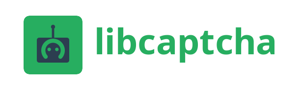

  

<h3 align="center"><b>Lib</b> stands for <b>Libre</b> — free as in freedom, not just free as in price.</h3>

A captcha system where **security comes from smart design, public scrutiny, and layered defense** — not from secrecy alone. Open source, self-hostable, no tracking.

## Why Libre

Most captcha providers fingerprint browsers, collect behavioral data, and hide detection logic behind proprietary walls. **LibCaptcha rejects this model.**

**Transparency at the core.** Server-side verification logic is fully open. Every challenge mechanism, every cryptographic decision is public and community-reviewed. If a server-side technique only works because nobody has seen it, it does not belong here.

**Client-side hardening through obfuscation.** The client challenge runner uses a [polymorphic WASM VM](https://github.com/libcaptcha/quickjs-wasm) — encrypted bytecode, symbol renaming, dead code injection, anti-debug. This is defense in depth: the server-side math holds regardless, but the client-side layer raises the cost of automated solving.

**Self-host or use our free service.** Run it on your infrastructure with zero external calls, or use the hosted service at no cost. Either way, no telemetry, no analytics pipeline, no user data collection.

## Security Model

| Layer | Approach |
|-------|----------|
| **Server-side** | Proof-of-work puzzles, cryptographic challenge binding, rate-aware verification, adaptive difficulty — all open source |
| **Client-side** | Polymorphic WASM VM executes challenges in a sandboxed, obfuscated environment unique per build |
| **Integration** | Client SDK with standard HTTP verification API |

The server-side is where correctness lives. The client-side is where cost-to-attack lives. Both are open source.

## Policies

**MIT licensed.** No CLA, no dual-licensing. Every contribution is freely usable by anyone.

**No telemetry, ever.** No phone-home, no analytics, no external calls. Design constraint, not feature toggle.

**Drop-in SDK, no lock-in.** Client SDK for easy integration. Standard HTTP API underneath — use the SDK or call the API directly.

**Transparent security.** Coordinated disclosure for critical issues, public post-mortems, open bug tracking.

Licensed under [MIT](LICENSE).
